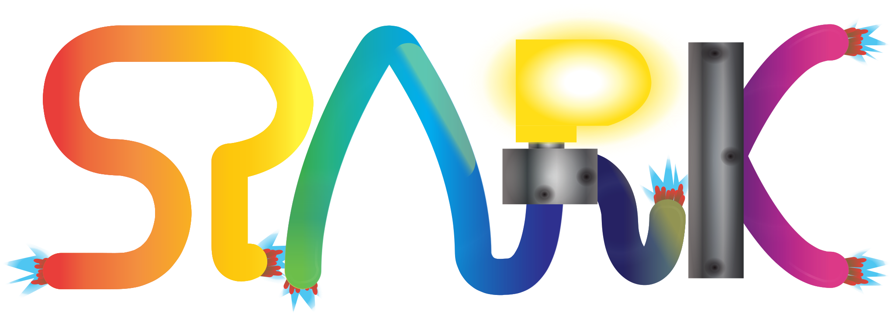

# Spark

## Table of Contents

[*What is Spark?*](#what-is-spark)                                            \
[*Why use Spark?*](#why-use-spark)                                            \
[*Information*](#information)                                                 \
[*What does Spark provide styles for?*](#what-does-spark-provide-styles-for)  \
[*Roadmap*](#roadmap)                                                         \
[*Cons*](#cons)

## What is Spark?

Spark is a lightweight CSS library that takes advantage of HTML's
 `data-`-attributes to easily apply complex styles to elements.

Spark is created to be simple to use and support as many web-browsers as
 possible for the features it supports.

## Why use Spark?

- Simple to read and write.  
- Spark is designed modularly, meaning you are able to import only the
   things you absolutely need.  
- Has out-of-the-box support for different (types of) elements.  
- Supports a wide range of web-browsers, including Internet Explorer.

## Information

    Last Updated: 2024/04/10
    Code Size:    84KB
    Version:      2.3.1

## What does Spark provide styles for?

Spark provides styles for many things, including:  
 - Dropdown Menus  
 - Tables  
 - Images  
 - Flex and Grid Items.  
 - Positioning  
 - Margins and Padding  
 - Miscellaneous, common, elements.  
 - Text and Anchortext.  
 - Code.

## Roadmap

- Add more spacing options (for padding).  
- Add more examples.

## Cons

- Because of its desire to support as many browsers as possible, the CSS
   files are bigger than they would otherwise be, meaning they take up more
   space and are (likelty to be) less performant.